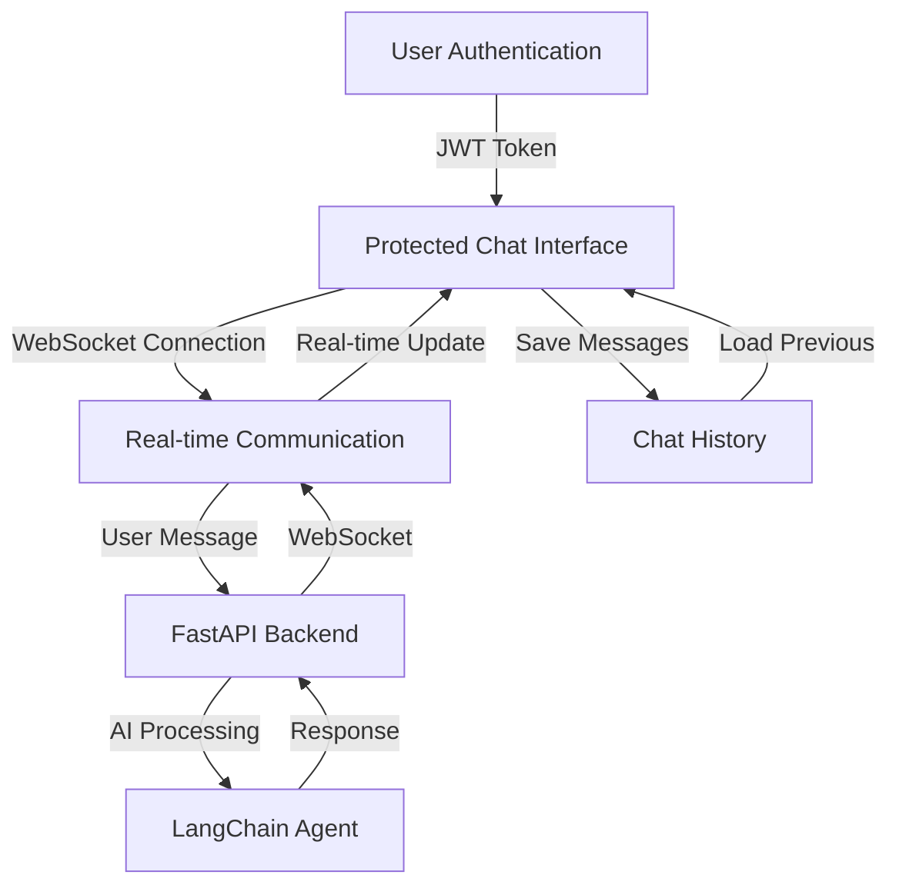

# 🧠 Wey, a Jarvis-Like AI Assistant## 📦 Features

### Version 1.0 ✅### Version 1.0 ✅
- **User Authentication System**
  - User registration and logiBy default, the frontend runs on [http://localhost:5173](http://localhost:5173)
and communicates with the backend at `http://localhost:8000` via REST API and WebSocket.unctionality
  - JWT-based authentication with protected routes
  - Session management with automatic token validation
- **Real-time Chat Interface**
  - WebSocket-based real-time messaging
  - Chat rooms with persistent message history
  - Typing indicators and message status
- **Modern UI/UX**
  - Responsive design built with TailwindCSS 4.x
  - Radix UI components for accessibility
  - Clean chat interface with markdown support
  - Loading states and smooth animations

### ⚡ Current Features (v1.5)
- Real-time bidirectional communication with backend via WebSocket
- Multiple chat rooms support
- Message persistence and history loading
- Protected routing system
- User session management
- Mobile-responsive sidebar navigation
- Error handling and loading states
- Environment-based configuration

### 🔊 Future Versions
- Voice input/output (STT + TTS)  
- Connection with personal productivity apps  
- Real-time device state visualization  
- Cloud deployment and SaaS capabilities  
- AI detects and executes commands like:
  > "Turn on the lamp" → sends MQTT command to IoT deviceication System**
  - User registration and login functionality
  - JWT-based authentication with protected routes
  - Session management with automatic token validation
- **Real-time Chat Interface**
  - WebSocket-based real-time messaging
  - Chat rooms with persistent message history
  - Typing indicators and message status
- **Modern UI/UX**
  - Responsive design built with TailwindCSS 4.x
  - Radix UI components for accessibility
  - Clean chat interface with markdown support
  - Loading states and smooth animations

### ⚡ Current Features (v1.5)
- Real-time bidirectional communication with backend via WebSocket
- Multiple chat rooms support
- Message persistence and history loading
- Protected routing system
- User session management
- Mobile-responsive sidebar navigation
- Error handling and loading states
- Environment-based configuration

### 🔊 Future Versions
- Voice input/output (STT + TTS)  
- Connection with personal productivity apps  
- Real-time device state visualization  
- Cloud deployment and SaaS capabilities  
- AI detects and executes commands like:
  > "Turn on the lamp" → sends MQTT command to IoT devices the **frontend** of `Wey` my personal AI Assistant — an intelligent, generative and context-aware system inspired by *Jarvis* from Iron Man.  
It's a personal challenge and research project that integrates **AI**, **IoT**, **Automation**, and **Software Engineering** in one experience.  

The goal: create a virtual assistant that I can **talk to**, **ask questions**, and **interact with in natural language** — eventually capable of controlling my environment (like turning on a lamp) and connecting with my own apps.

---

## 🚀 Project Overview

The assistant is being built as a modular system composed of:
- 🖥 **Frontend (this repo)** — Real-time chat interface with authentication, built with React + TypeScript + TailwindCSS.  
- ⚙️ **Backend** — FastAPI + LangChain orchestration for AI reasoning, tool calls, and device control via MQTT.  
- 🌐 **IoT Devices** — ESP32-based devices connected through MQTT to execute commands.  

This frontend features a complete chat application with user authentication, real-time messaging via WebSocket, and a modern responsive UI built with Radix UI components.

---

## 🧩 Tech Stack

| Layer | Technologies |
|-------|---------------|
| **Framework** | React 19, TypeScript, Vite |
| **Styling** | TailwindCSS 4.x, Radix UI Components |
| **State Management** | TanStack React Query, React Context |
| **Routing** | React Router DOM v7 |
| **Authentication** | JWT tokens, Protected Routes |
| **Real-time** | WebSocket connection |
| **Icons** | Lucide React |
| **Build Tools** | Vite, TypeScript, ESLint |
| **Backend Communication** | REST API + WebSocket |

---

## 📦 Features

### Version 1.0 ✅
- Chat interface (text-based)  
- Integration with FastAPI backend  
- Displays assistant replies in real-time  
- Sends user messages to backend endpoint (`/chat`)  

### ⚡ Version 1.5 (in development)
- AI detects and executes commands like:
  > “Turn on the lamp” → sends MQTT command to IoT device  
- Persistent session history  
- Improved UI with chat bubbles and action logs  

### 🔊 Future Versions
- Voice input/output (STT + TTS)  
- Connection with personal productivity apps  
- Real-time device state visualization  
- Cloud deployment and SaaS capabilities  

---

## 🛠️ Getting Started

### 1️⃣ Clone the repository
```bash
git clone https://github.com/EriveltoSilva/wey-my-personal-ai-assistant-backend.git
cd wey-my-personal-ai-assistant-backend/frontend
````

### 2️⃣ Install dependencies

```bash
npm install
# or
yarn install
```

### 3️⃣ Environment Configuration

Create a `.env` file in the frontend root directory:

```env
VITE_API_URL=http://localhost:8000
VITE_WS_URL=ws://localhost:8000
```

### 4️⃣ Start the development server

```bash
npm run dev
```

By default, the frontend runs on [http://localhost:5173](http://localhost:5173)
and communicates with the backend at `http://localhost:8000/chat`.
You can adjust this in the project’s `.env` file or Vite config.

---

## 🧠 How It Works



---

## 🧰 Project Structure

```
wey-frontend/
│
├── src/
│   ├── components/            # Reusable UI components
│   │   ├── ui/               # Base UI components (Button, Dialog, etc.)
│   │   ├── chats/            # Chat-specific components
│   │   ├── sidebar-components/ # Navigation components
│   │   ├── layout.tsx        # Main layout wrapper
│   │   └── protected.tsx     # Route protection component
│   │
│   ├── pages/                # Page components
│   │   ├── chats/            # Chat pages (init, room)
│   │   ├── login.tsx         # Authentication pages
│   │   └── signup.tsx
│   │
│   ├── hooks/                # Custom React hooks
│   │   ├── use-auth.ts       # Authentication logic
│   │   ├── use-chat.ts       # Chat functionality
│   │   ├── use-mobile.ts     # Mobile responsiveness
│   │   └── use-sidebar.ts    # Sidebar state
│   │
│   ├── contexts/             # React contexts
│   │   └── websocketContext.tsx # WebSocket management
│   │
│   ├── constants/            # App constants
│   │   ├── api.ts           # API endpoints
│   │   └── logo.ts          # Logo assets
│   │
│   ├── lib/                  # Utility libraries
│   ├── types/                # TypeScript type definitions
│   ├── styles/               # Global styles
│   ├── data/                 # Static data files
│   ├── app.tsx              # Main React component with routing
│   └── main.tsx             # Application entry point
│
├── public/                   # Static assets (images, icons)
├── components.json          # shadcn/ui configuration
├── package.json             # Dependencies and scripts
├── tailwind.config.js       # TailwindCSS configuration
├── tsconfig.json            # TypeScript configuration
├── vite.config.ts           # Vite build configuration
└── README.md                # This file
```

---

## 🧪 Example Usage

### Current Chat Functionality

1. **User Registration/Login**
   ```
   User signs up → JWT token generated → Access to chat interface
   ```

2. **Real-time Chat**
   ```
   User: "Hello, how can you help me today?"
   Assistant: "Hi! I'm Wey, your AI assistant. I can help you with questions, 
              conversations, and in the future, control your IoT devices!"
   ```

3. **Chat Rooms**
   ```
   Users can create multiple chat rooms and switch between them
   Chat history is persistent and loads automatically
   Real-time typing indicators show when the assistant is responding
   ```

### Future IoT Integration

When connected to the backend MQTT system:

> **User:** Turn on the lamp  
> **Assistant:** Okay — I sent the command to turn the lamp ON.

The ESP32 subscribed to `home/room1/lamp` receives the message and activates the GPIO pin linked to your lamp.

---

## 💡 Roadmap

| Version  | Goal                                              | Status |
| -------- | ------------------------------------------------- | ------ |
| **v1.0** | ✅ User authentication & real-time chat interface | ✅ Complete |
| **v1.5** | ✅ WebSocket communication & chat rooms          | ✅ Complete |
| **v2.0** | 🔄 Device control (IoT) through conversation     | 🔄 In Progress |
| **v2.5** | 📋 Add voice (STT/TTS) and context memory        | 📋 Planned |
| **v3.0** | 🚀 Omnichannel experience + multi-app integration | 🚀 Future |
| **v4.0** | 🌐 Scalable SaaS product with AI + IoT core      | 🌐 Future |

---

## 🤖 Author

**Erivelto Clénio da Costa e Silva**
Software Developer | AI & IoT Enthusiast | Founder of K.A Solutions
🌐 [Portfolio](https://erivelto-silva-portfolio.vercel.app)

---

## 🛡️ License

This project is licensed under the [MIT License](LICENSE).

---

## ⚙️ Future Vision

> “Not just another virtual assistant — but a personalized AI companion that connects software, intelligence, and the physical world.”

---
